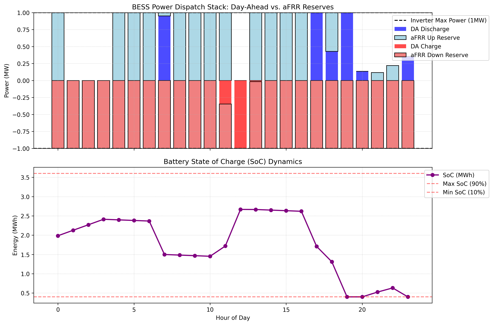
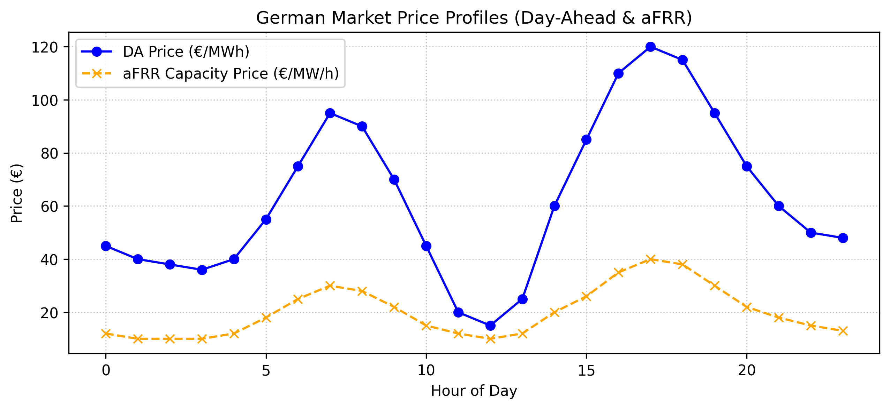

# ⚡ BESS Revenue Stacking & Degradation Optimizer

[](https://dl.circleci.com/gh/Mohammadrezarefaei/bess_revenue_stacking_optimizer/tree/main)
[](https://www.python.org/)
[](https://opensource.org/licenses/MIT)
[](https://bessrevenuestackingoptimizer-oszlxgvw3wc45cqkpzgcbg.streamlit.app/)

A production-grade Mixed-Integer Linear Programming (MILP) optimization framework designed for the German electricity market. This tool co-optimizes **Day-Ahead Arbitrage** and **aFRR (Automatic Frequency Restoration Reserve) Capacity Reserves** for a 4 MWh / 1 MW Battery Energy Storage System (BESS) while explicitly modeling non-linear throughput degradation costs.

---

## 🌐 Live Web Application
Explore the interactive Streamlit dashboard to test different degradation penalties and activation rates in real-time:
👉 **[BESS Revenue Stacking Web App](https://bessrevenuestackingoptimizer-oszlxgvw3wc45cqkpzgcbg.streamlit.app/)**

---

## 📊 Financial Performance Summary

| Metric | Value (€) | Description |
| :--- | :--- | :--- |
| **Gross DA Revenue** | €359.59 | Revenue from buying low and selling high in Day-Ahead energy market |
| **Gross aFRR Revenue** | €734.21 | Capacity availability payment from the German aFRR ancillary service |
| **Total Gross Revenue** | €1,093.80 | Combined gross earnings before asset degradation |
| **Degradation Cost Penalty** | -€158.61 | Non-linear throughput cost penalty protecting cell lifespan (~15% of gross) |
| **Optimized Net Profit** | **€935.19** | **Final net daily earnings accounting for physical wear** |

---

## 📈 Visual Dispatch Dynamics & SoC Profiles

### 1. Power Dispatch Stack (DA vs. aFRR)
The solver intelligently allocates inverter capacity (capped strictly at 1 MW) between energy arbitrage and lucrative frequency reserves, prioritizing aFRR due to its high capacity payments and low physical activation rate (~15%).

<p align="center">
  
</p>

### 2. German Market Price Profiles
Optimization is driven using real German market price signals for Day-Ahead energy (€/MWh) and aFRR capacity availability (€/MW/h).

<p align="center">
  
</p>

---

## 🏗️ Repository Architecture

```text
bess_revenue_stacking_optimizer/
├── .circleci/
│   └── config.yml           # CI/CD automated pipeline for cloud testing
├── outputs/
│   ├── market_prices_afrr_da.png
│   ├── dispatch_and_soc_dynamics.png
│   └── financial_summary.csv
├── src/
│   ├── __init__.py
│   └── stacking_optimizer.py # Core MILP optimization engine (PuLP)
├── notebooks/
│   └── revenue_stacking_analysis.ipynb
├── tests/
│   ├── __init__.py
│   └── test_stacking_optimizer.py # Pytest suite for mathematical constraints
├── app.py                   # Interactive Streamlit dashboard
├── pytest.ini               # Pytest configuration
├── requirements.txt         # Project dependencies
└── README.md
